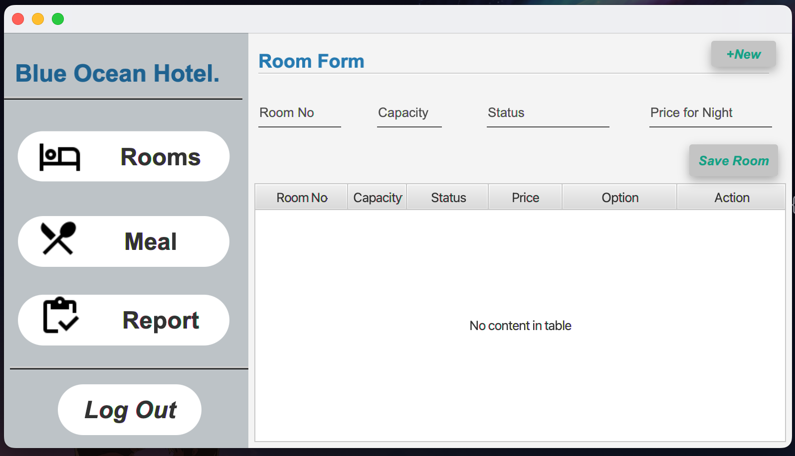

# Room Reservation System

---

### Description.
Following types of people accessing the system:
* Admin
* Receptionist

Admin can register Rooms and add Meals to the System. 
A customer can come to the hotel in person or contact the front desk over the 
phone for a reservation. Once the customer inquires about rooms and packages, 
the receptionist provides them with the relevant details by referring to the system. 
Once the customers make their pick, the receptionist will check the availability of 
the rooms and inform them. If the requested type is not available, the receptionist 
should find other suitable types and suggest them to the customer from the information 
in the system.

### Languages & Tools

* Java
* JavaFX
* Scene Builder
* Intellij IDEA
---

# Project View.

### profile

### Main Interface

### Admin Login

### Admin Dashboard

### Receptionist Login

### Receptionist Dashboard

---

